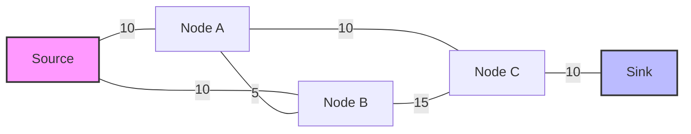
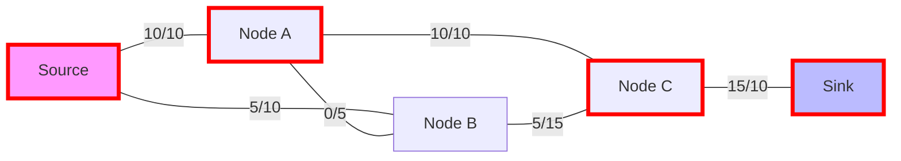
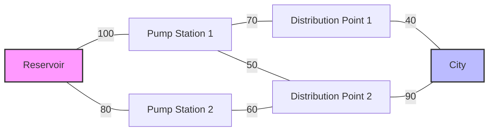

# Edmonds-Karp Algorithm Implementation

## Overview

This repository contains a Python implementation of **Edmonds-Karp Algorithm**, a classic graph algorithm for finding the maximum flow in a flow network. The implementation uses an adjacency matrix representation of the graph and includes comprehensive testing to ensure correctness.

## Visual Representation of the Graph

Below is a visualization of a sample flow network. The numbers on the edges represent the capacities of the edges.



The graph above corresponds to the following capacity matrix:

```
[
    [0, 10, 10, 0],
    [0, 0, 5, 10],
    [0, 0, 0, 15],
    [0, 0, 0, 0]
]
```

## Maximum Flow Found

In this example, when finding the maximum flow from **Source** to **Sink**, the algorithm determines that the optimal flow is **15 units**:



**Total Maximum Flow:** 15 units

## Example with Water Supply Network

To illustrate the algorithm with a more concrete example, we can imagine that the vertices are locations in a water supply network and the weights are pipe capacities in liters per second:



If we want to find the maximum flow from the **Reservoir** to the **City**, the algorithm will determine that the maximum amount of water that can flow is **130 liters per second**.

## Algorithm Details

The Edmonds-Karp algorithm is an implementation of the Ford-Fulkerson method for computing the maximum flow in a flow network. The key difference is that it uses BFS to find augmenting paths, which guarantees a polynomial time complexity.

### Time Complexity

- **Time Complexity**: O(V × E²) where V is the number of vertices and E is the number of edges
- **Space Complexity**: O(V²) for storing the capacity matrix

## Usage Example

```python
from edmonds_karp import EdmondsKarp

# Define a graph as an adjacency matrix of capacities
# 0 means no direct connection between vertices
# Positive values represent the capacity between vertices
capacity = [
    [0, 10, 10, 0],
    [0, 0, 5, 10],
    [0, 0, 0, 15],
    [0, 0, 0, 0]
]

# Create an EdmondsKarp instance
ek = EdmondsKarp(capacity)

# Find the maximum flow from source (0) to sink (3)
max_flow = ek.find_max_flow(0, 3)

print(f"Maximum flow: {max_flow}")
```

## Tests

The implementation comes with comprehensive unit tests that verify:

1. Correct handling of graphs without edges
2. Proper calculation of flow with a single edge
3. Accurate maximum flow computation in more complex networks
4. Handling of special cases:
   - Infinite capacity
   - Minimum capacity
   - Zero capacity
   - Equal and different capacities
5. Proper validation of negative capacities

Run the tests using:

```
python -m unittest tests.test_edmonds_karp
```

## Limitations

1. This implementation uses an adjacency matrix, which is efficient for dense graphs but uses O(V²) space even for sparse graphs.
2. The algorithm does not support negative capacities.
3. The original capacity matrix is modified during the algorithm execution, so if you need to preserve it, make a copy before running the algorithm.

## Future Improvements

Possible enhancements to consider:
- Implement an adjacency list representation for better space efficiency with sparse graphs
- Add support for edge tracking to visualize the final flow distribution
- Implement a function to return the minimum cut
- Add support for saving and loading flow networks

## Contributing

Contributions are welcome! Please feel free to submit a Pull Request.